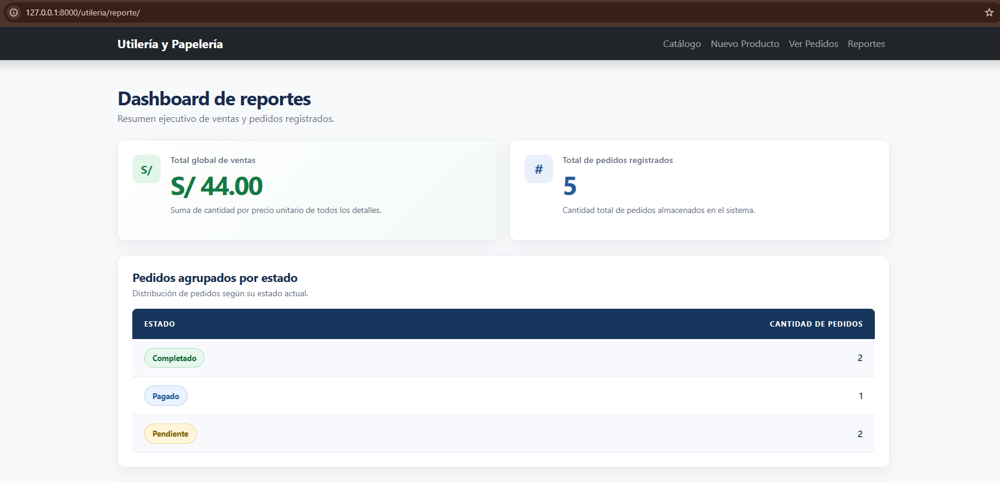

# Semana 07 — Aplicación de utilería en Django

Este directorio contiene el proyecto de la semana. El proyecto ejecutable de
Django se encuentra dentro de `src/`; la aplicación principal para estos
ejercicios es `utileria`.

## Requisitos e instalación

Se requiere Python 3.10 o posterior. Desde la carpeta `semana-07`, instala las
dependencias declaradas en este directorio:

```powershell
python -m pip install -r requirements.txt
```

Luego ejecuta los comandos de Django desde `src`:

```powershell
cd src
python manage.py migrate
python manage.py runserver
```

El proyecto usa SQLite de forma predeterminada. Algunas rutas de utilería son:

- Catálogo de productos: `http://127.0.0.1:8000/utileria/`
- Listado de pedidos: `http://127.0.0.1:8000/utileria/pedidos/`
- Registro transaccional: `http://127.0.0.1:8000/utileria/registrar-pedido-transaccion/`
- Reportes: `http://127.0.0.1:8000/utileria/reporte/`

## Ejercicio 14 — Publicar en GitHub

Este README y `requirements.txt` describen cómo instalar y ejecutar el proyecto
y documentan las funcionalidades de investigación de la aplicación. Para
publicar los cambios, guarda ambos archivos en el repositorio, revisa los
cambios, crea un commit y envíalo al repositorio GitHub configurado para el
proyecto:

```powershell
git status
git add README.md requirements.txt
git commit -m "Documentar ejercicios de investigación Django"
git push
```

## Operación transaccional de pedidos

La vista `registrar_pedido_transaccion` en `src/utileria/views.py` registra una
operación que afecta a tres modelos: `Producto`, `Pedido` y `DetallePedido`.
Valida la cantidad solicitada y comprueba que haya stock disponible. Dentro de
`transaction.atomic()` descuenta `Producto.stock` usando la expresión `F()` y
crea el pedido y su detalle con la cantidad y precio unitario.

Si el stock no alcanza, se provoca una excepción dentro del bloque atómico. Al
salir del bloque, Django revierte los cambios de esa transacción, evitando que
quede un pedido sin su descuento correspondiente o un descuento parcial. La
vista comunica los resultados con mensajes de éxito o error y redirige al
formulario siguiendo el patrón Post/Redirect/Get.

## Reportes

La vista `reporte_view` y la plantilla `src/utileria/templates/utileria/reporte.html`
presentan dos agregaciones:

1. **Total global de ventas:** `DetallePedido.objects.aggregate(...)` suma en la
   base de datos el producto de `cantidad × precio_unitario` para todos los
   detalles.
2. **Pedidos por estado:** la consulta usa `values('estado').annotate(...)` para
   agrupar los pedidos por estado y contar los registros de cada grupo. La lógica
   está encapsulada y se reutiliza mediante `Pedido.objects.conteo_por_estado()`.

## QuerySet y Manager personalizados

`PedidoQuerySet`, definido en `src/utileria/models.py`, proporciona métodos
reutilizables y encadenables para consultar pedidos:

- `pendientes()` filtra pedidos cuyo estado es `Pendiente`.
- `del_mes()` filtra pedidos cuya fecha corresponde al mes y año actuales.
- `conteo_por_estado()` agrupa los pedidos por estado y cuenta cuántos hay en
  cada grupo.

El manager de `Pedido` se crea con `models.Manager.from_queryset(PedidoQuerySet)`.
Por ello, los métodos están disponibles desde `Pedido.objects`. Por ejemplo, la
vista del listado encadena `Pedido.objects.pendientes().del_mes()`, y el reporte
usa `Pedido.objects.conteo_por_estado()`.

## Optimización del problema N+1

La vista `pedido_list` muestra cada pedido junto con el cliente, el proveedor,
los detalles y el producto asociado a cada detalle. Para evitar consultas
repetidas durante el renderizado, la consulta aplica:

- `select_related('cliente', 'proveedor')`: carga las relaciones `ForeignKey`
  de cliente y proveedor con `JOIN` en la consulta principal.
- `prefetch_related('detallepedido_set__producto')`: carga los detalles y los
  productos relacionados mediante consultas separadas que Django combina en
  memoria.

La cantidad de consultas puede medirse en desarrollo con
`django.db.connection.queries` y `reset_queries()`, recorriendo las mismas
relaciones antes y después de aplicar la precarga. El resultado depende de los
pedidos y detalles que haya en la base de datos.

## Entidades del proyecto

La aplicación `utileria` tiene estas diez entidades:

1. `Proveedor`
2. `Categoria`
3. `Cliente`
4. `PerfilCliente`
5. `Producto`
6. `FichaTecnicaProducto`
7. `UbicacionAlmacen`
8. `Pedido`
9. `DetallePedido`
10. `ComprobantePago`

## Evidencia



`DetallePedido` es el modelo intermedio entre `Pedido` y `Producto`; almacena
cantidad y precio unitario para cada línea del pedido.

## Nota de configuración

La configuración incluida está pensada para desarrollo académico. Antes de
publicar el proyecto en un servidor, configura una clave secreta segura,
`DEBUG = False`, hosts permitidos y una base de datos adecuada para producción.
